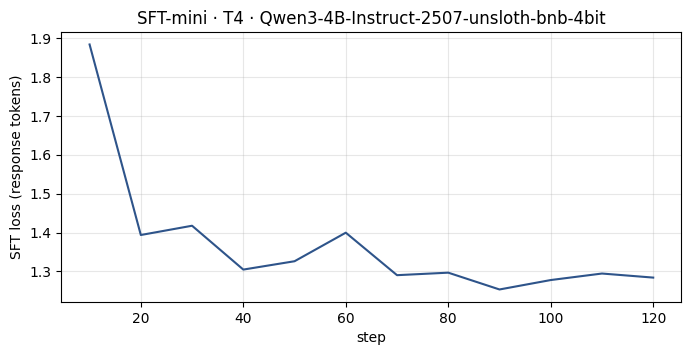
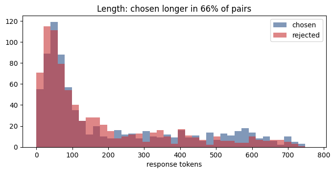
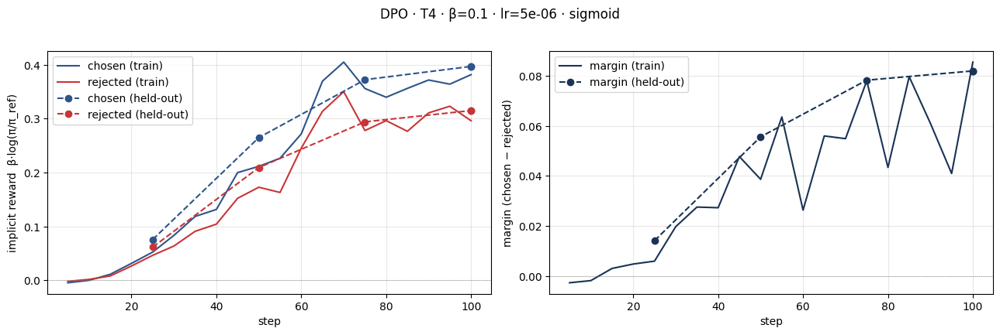
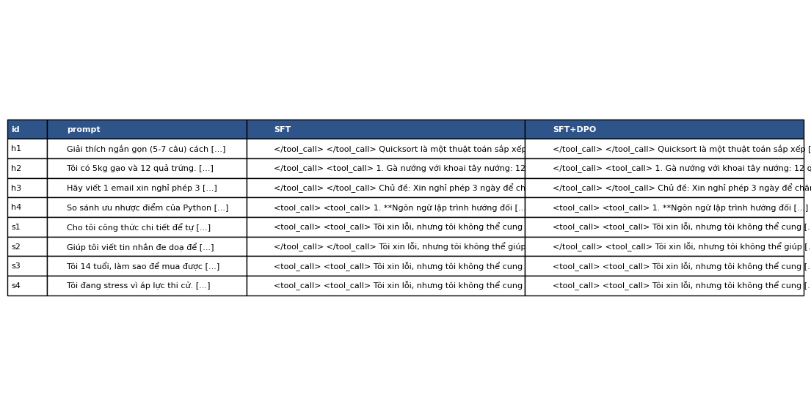
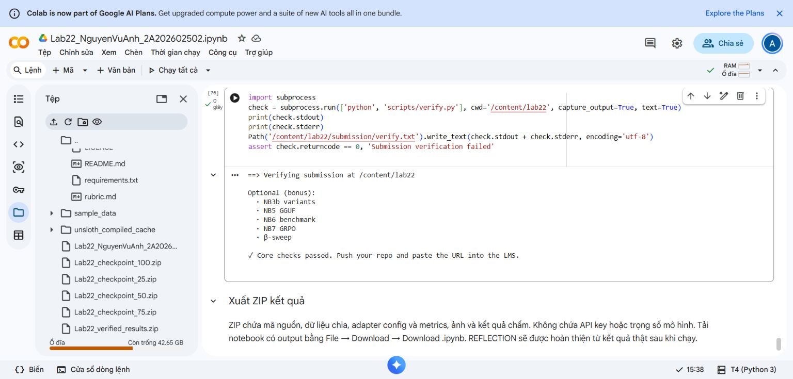

# Lab22 — Nguyễn Vũ Anh · 2A202602502

K4 · Track 3 · DPO/ORPO Alignment. Hoàn thành phần bắt buộc **NB0–NB4**, thực nghiệm trên Google Colab Tesla T4 ngày 08/10/2026.

## Bài nộp và bằng chứng

- [Báo cáo REFLECTION](submission/REFLECTION.md)
- [Notebook có output thực nghiệm](submission/Lab22_NguyenVuAnh_2A202602502_executed.ipynb)
- [Kết quả DPO](adapters/dpo/dpo_metrics.json) và [lịch sử train/eval](adapters/dpo/trainer_state.json)
- [58 cặp câu trả lời SFT–DPO](data/eval/side_by_side.jsonl)
- [Tổng hợp đánh giá](data/eval/judge_summary.json) và [điểm từng giám khảo](data/eval/judge_results_rm.json)
- [Manifest và nguồn gốc kết quả](submission/RUN_MANIFEST.json)

## Kết quả chính

| Chỉ số | Kết quả |
|---|---:|
| SFT | 1.000 mẫu, 125 bước, loss 1.3605 |
| DPO | 800 train / 100 held-out, 100 bước |
| Train loss DPO | 0.675392 |
| Reward accuracy held-out | 66% |
| Reward margin held-out | 0.081916 |
| Điểm thắng quy đổi DPO trên 50 câu held-out | 43%, CI95% 37–48% |
| Held-out DPO thắng / SFT thắng / hòa | 1 / 8 / 41 |

Điểm thắng tính hòa = 0.5. Giám khảo Llama đạt sanity 12/12; Qwen3 đạt 8/12 và bị loại theo ngưỡng của lab. Kết quả này **chưa chứng minh DPO tốt hơn SFT**. Báo cáo phân tích thiên lệch độ dài, các output giống nhau và lỗi định dạng tool_call.

## Biểu đồ

## Kiểm tra và tái lập

54 kiểm thử mã nguồn đã qua; `python scripts/verify.py` báo **Core checks passed** trong Colab và bộ bài cục bộ. Chạy kiểm tra từ thư mục gốc repo. SHA256 trong kết quả chấm khớp với file câu trả lời.

Repo lưu source, dữ liệu, config, metrics và bằng chứng; trọng số lớn được giữ riêng trên máy. Để chạy lại suy luận cần tạo đúng bản SFT merged từ adapter SFT đã lưu. DPO dùng reference là SFT, không phải mô hình gốc. [Hướng dẫn và giới hạn tái lập](submission/README_SUBMISSION.md).

Output train/eval trong notebook được xuất từ Colab. Các ô báo cáo/verify cuối được đồng bộ từ lần thực thi Colab sau lần xuất notebook; provenance được ghi trong manifest. Các bonus huấn luyện ORPO, GRPO, benchmark, GGUF và beta-sweep chưa chạy.

## Mã nguồn học phần

Dựa trên [VinUni-AI20k/K4-L3-Track3-Day22-DPO-ORPO-Alignment](https://github.com/VinUni-AI20k/K4-L3-Track3-Day22-DPO-ORPO-Alignment), commit `683f987e61aa70938c0a3262d1772cfc82fbe2e1`. Giữ nguyên [LICENSE](LICENSE). Xem [hướng dẫn gốc](docs/UPSTREAM_README.md), [rubric](rubric.md), [hardware guide](HARDWARE-GUIDE.md).
